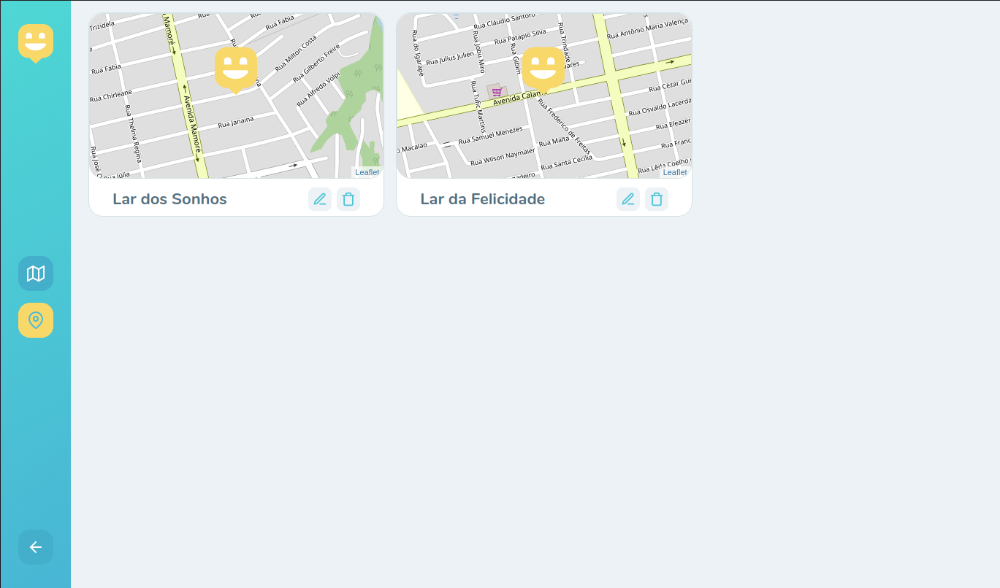
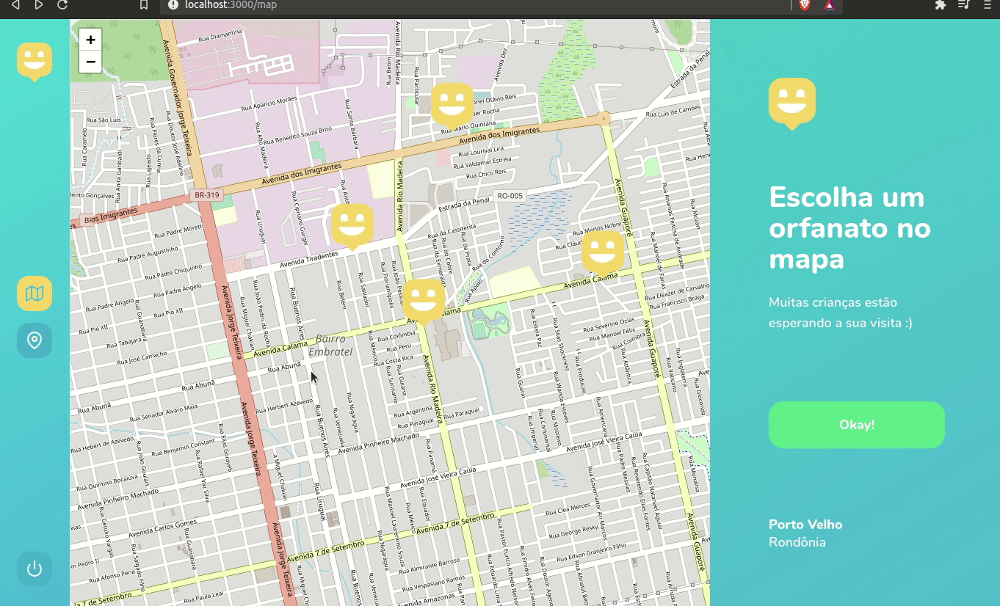

# Happy


<p align="center">

</p>

## Sumário
[Introdução](#introdução) :door:  
[Como a Aplicação Funciona](#como-a-aplicação-funciona) :open_book:  
[Algumas das Tecnologias](#algumas-das-tecnologias) :computer:  
[Passo a passo](#passo-a-passo) :open_book:  

## Introdução

Sabemos da importancia de transmitir amor e alegria, para as crianças e adolescentes que se encontram em instituições de acolhimento. E sabendo dessa importancia
surgiu o Happy, que é uma aplicação com o intuito de informar além da localidade, informações sobre instituições de acolhimento na cidade de Porto Velho.

    
## Como a Aplicação Funciona
Até o momento, é possivel registrar uma institução de acolhimento no mapa da cidade. Sendo possivel analisar pelo mapa, onde se encontra essas instituições
e mais informações sobre a mesma. Tanto na aplicação Web, quanto na Mobile.
**Obs:** (Deve ser feita uma atualização na versão Mobile, podendo não estar funcionando adequadamente devido as novas funcionalides adicionadas no back-end e Web, referentes a autenticação).

<p align="center">

</p>
    
  
A aplicação na Web, ainda conta com mais algumas funcionalidades, como:  
- A possbilidade de se Registrar e fazer autenticação;
  
<p align="center">


</p>

- A possibilidade de visualizar os orfanatos que você registrou

<p align="center">

</p>
  
- E a possibilidade de excluir (A de editar, ainda não foi adicionada)

<p align="center">

</p>


## Algumas das Tecnologias

**Back-End (NodeJS com TypeScript): SQLite**  
Algumas das bibliotecas utilizadas:
- Express
- typeorm
- cors
- Yup

**Front-End (ReactJS com TypeScript)**  
Algumas das bibliotecas utilizadas:
- axios
- react-icons
- react-router-dom
- react testing library / jest
- leaflet
- Framer Motion
- Redux
- Redux-saga


**Mobile (React Native com TypeScript)**  
- axios
- react-icons
- react-router-dom
- leaflet

## Passo a passo

Com Yarn
```
$ git clone https://github.com/MarcusMartins38/Happy_NLW03.git
$ cd Happy_NLW03/backend
$ yarn
$ yarn dev
$ cd Happy_NLW03/web or cd Happy_NLW03/mobile
$ yarn
$ yarn start
```
Com Npm

```
$ git clone https://github.com/MarcusMartins38/Happy_NLW03.git
$ cd Happy_NLW03/backend
$ npm install
$ npm dev
$ cd Happy_NLW03/web or cd Happy_NLW03/mobile
$ npm install
$ npm start
```

----
**USANDO NO TCC:**


**node versão = v14.19.0**


`git clone https://github.com/MarcusMartins38/Happy_NLW03.git`


Acessar a branch de TCC:
`git checkout tcc_dev`

Acessando e fazendo o setup do servidor/backend:
```
cd Happy_NLW03/backend
npm install
npm run dev
```

Acessando e fazendo o setup da aplicação web:
```
cd Happy_NLW03/web
npm install
npm run start
```

